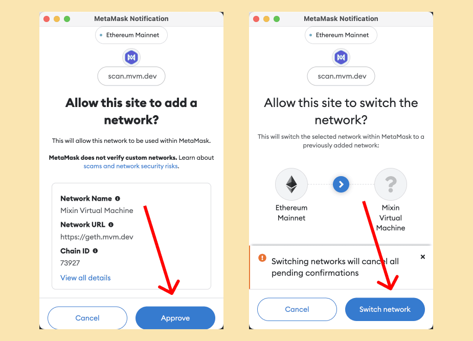
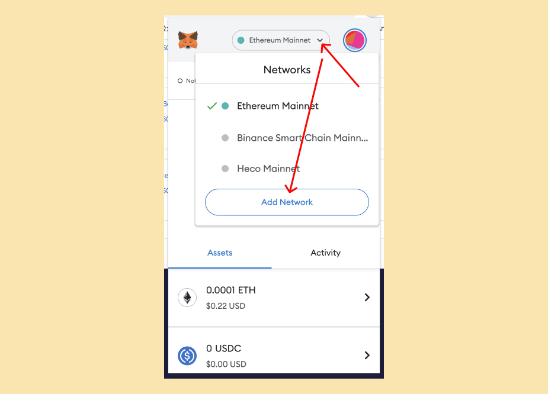
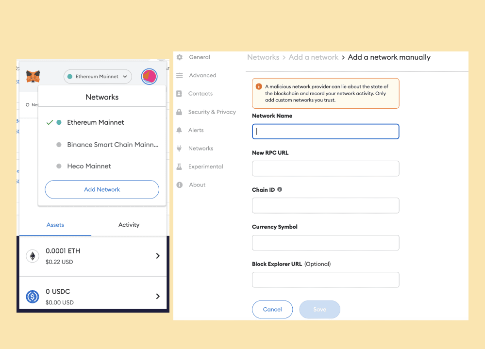
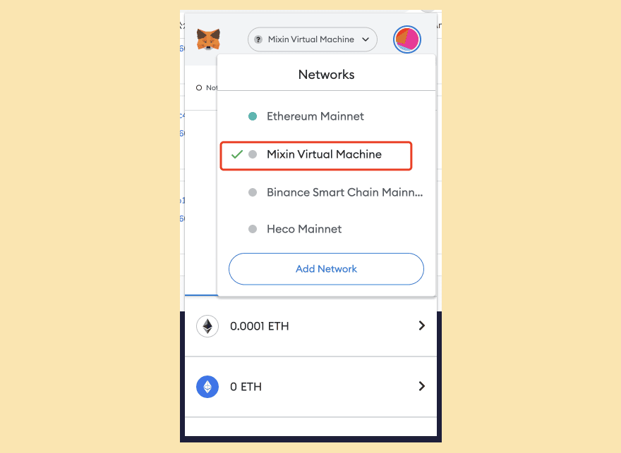
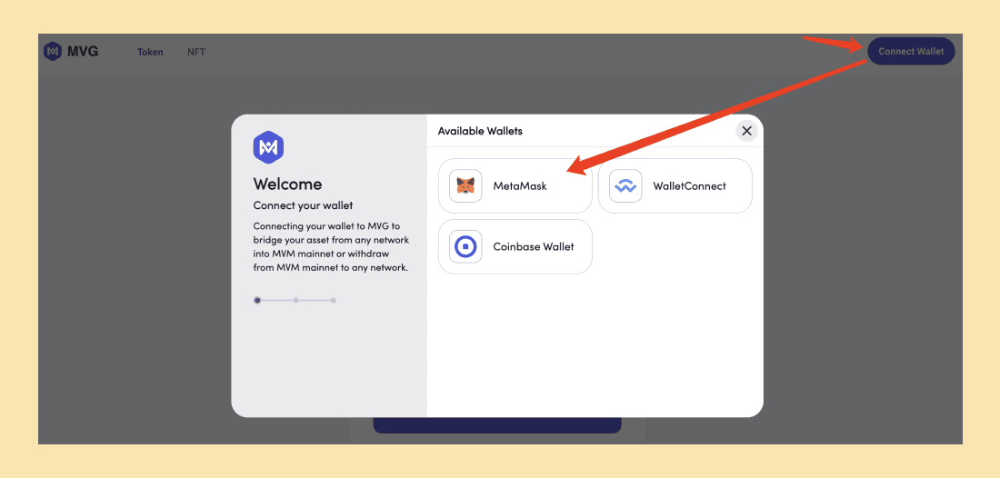
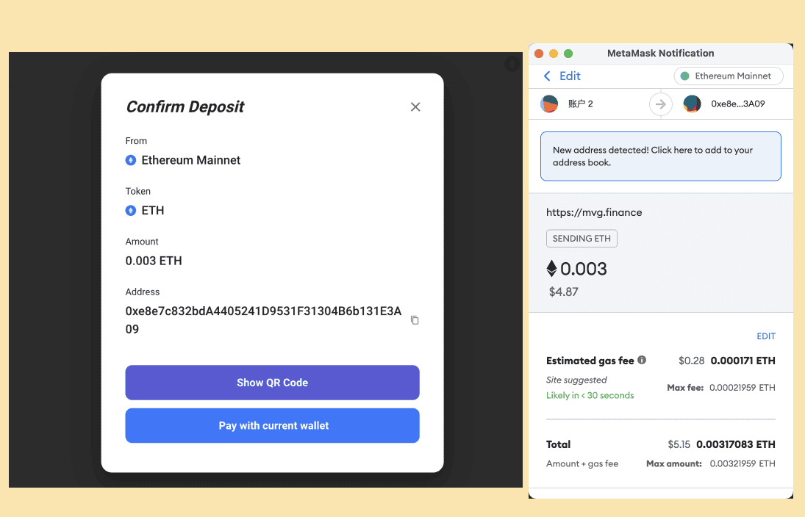
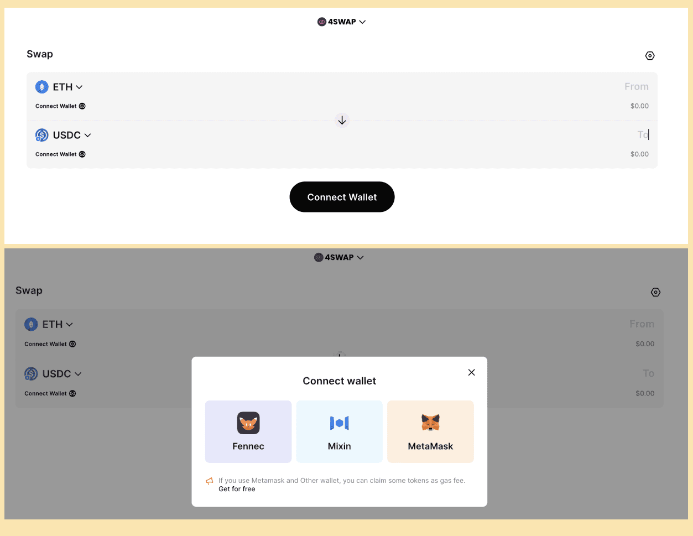

Before learning about how to connect to 4swap using MetaMask, you would need to have the MetaMask wallet installed and have got familiar with its basic functionalities. If you are not yet familiar, you can visit [MetaMask Support](https://metamask.zendesk.com/hc/en-us) for instructions.

To ensure the safety of your assets, please follow the security instructions closely. Be sure to keep your private key and password in secure and private places.

Now, we are ready to talk about how to connect to 4swap using MetaMask.

## Step One: Add MVM network to your MetaMask wallet

### Option 1

1. Go to MetaMask and keep your session active.

      

2. Go to [MVM Blockchain Viewer](https://scan.mvm.dev/). You can see "Add MVM to MetaMask" at the bottom of the page. 

     

3. Click on the item and you will see a confirmation window pop up. click on the "Approve" button. 

     

### Option 2

1. Open your MetaMask plug-in (on the top right of your screen) and click on the button showing your current selected network. In the Networks drop-down menu, you will see "Add Network" at the bottom. Click on it.

   

2. You will be directed to a new window asking you to fill in the information of the new network. Copy the below information and fill them in the corresponding boxes on the page. Then click on "Save".

   

   Network name: Mixin Virtual Machine

   Network URL: https://geth.mvm.dev 

   Chain ID: 73927

   Currency symbol: ETH

   Block Browser: https://scan.mvm.dev/

After that, you successfully add "Mixin Virtual Machine" to your MetaMask and it's selected as your current network. You can click on the drop-down menu to switch to other networks.

- 

## Step Two: Send assets to MVM network using other networks through cross-chain bridges

Next, you need to transfer some assets to the MVM address. It's done using the official cross-chain bridge offered by Mixin Network.

1. Launch the [Assets Bridge](https://mvg.finance/) and link the MetaMask wallet. 

   

2. Choose the network from which you will use to top up the MVM network. "Ethereum Mainnet" is selected here as an example.

   

3. Click on "Deposit" and then confirm deposit from the current wallet. You will see an address in the pop-up window. You can send money directly to this address as an alternative way to top-up your MVM wallet.

   

   

4. After confirming deposit, wait for a bit and you will see a change of the balance in your MetaMask wallet. it is recommended that you only deposit a small amount as a test for the first time.

   

## Step Three: Connect your MetaMask wallet to 4swap and start trading 

After depositing assets to the MVM address, now you are ready to trade them through 4swap.

1. Connect your MetaMask wallet to [4swap](https://4swap.org/)

   

   

2. Click “Swap” after choosing the currency and entering the quantity.

   

3. Give it a while for the transaction to be processed. 

   

Congratuations! By following the above steps, you will be able to successfully swap in 4swap using your MetaMask wallet. Enjoy the lightening fast, gas-fee-free trading experience! 

## Join the Pando Community

Welcome to join our community and follow the latest community trends or event information.

- Twitter: [@4swapOrg](https://twitter.com/4swapOrg)

- Telegram: [t.me/its_4swapOrg](https://t.co/g7Vioijgjb)

- Discord: https://discord.com/invite/ek45g3Cymd

- Reddit: https://www.reddit.com/r/pando/

If you have already downloaded [Mixin Messenger](https://mixin.one/messenger), feel free to join our Mixin community.

4swap Community: 7000103925

Pando Community: 7000104110

If you have problems using Pando, you can check [Pando documentation](https://docs.pando.im/) or ask questions in the community. The administrator will be happy to help you.