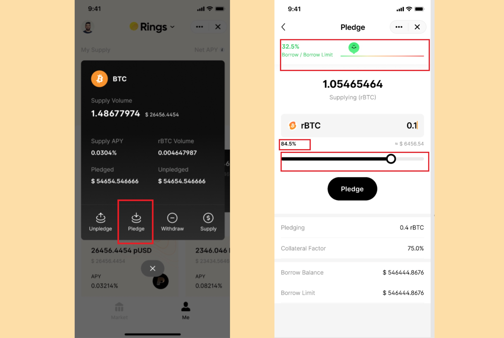

If you want to borrow, you will need to pledge as borrowing in Pando Rings function on the collateral-backed mechanism.  

After pledging, the rTokens you get from supplying will be locked into the system. You will not be able to transfer your pledged rTokens to others, but you can still gain supply interest of those you pledge.

:::info
**The difference between manually 「Pledge」 and one-stop 「Supply and Pledge」**

If you manually pledge, you can decide on the percentage of the supplied asset you want to pledge. In comparison, if you choose  to use the one-stop Supply and Pledge function (accessible from both Supply page and Borrow page), the system will pledge 100% of the rTokens while you supply.

If unfortunately, the value of your pledged assets cannot cover your borrow anymore, **ALL** of your pledged assets will be subjected to [liquidation](../key-concepts/liquidation) while your unpledged assets will stay intact. 

It's up to you make the tradeoff between getting more borrowing power by pledging more and pledging only partically for isolation of risk.
:::

To pledge, you can click on the supplied asset card of the Supply section on the Me page. 

Drag on the progress bar to choose the percentage you want to pledge. As the amount change, the status of the risk loan indicator also change. You can pay close attention to the indicator to monitor the predicted risk of the loan after you pledge. 

