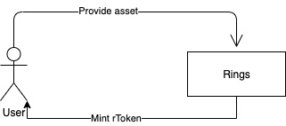

Eine Implementierung des [Compound Protokolls](https://github.com/compound-finance/compound-protocol) basierend auf [Mixin](https://github.com/MixinNetwork/mixin) [MTG](https://github.com/MixinNetwork/developers.mixin.one/blob/main/developers/src/i18n/en/document/mainnet/mtg.md) Technologie.

## rToken

Der zugehörige Zertifikatstoken, den Sie erhalten, nachdem Sie eine Reihe von Cetain verschlüsselter Währung an den Markt geliefert haben.

## Funktion

### Belieferung

Benutzer liefern verschlüsselte Währungen an den Markt, um Liquidität zu gewährleisten, und erhalten die entsprechenden Rtoken. Sie erhalten Zinserträge durch die Bereitstellung von Liquidität.

### Unterstützung

Benutzer müssen rToken dem Markt versprechen, bevor sie Kredite aufnehmen.

### Unversprechen

Die Nutzer nehmen den dem Markt zugesagten rToken zurück.

### Redeem

Benutzer geben den rToken im Gegenzug für die zugehörige verschlüsselte Währung, die vorher geliefert wurde, zurück, einschließlich Zinserträge als Belohnung für die Bereitstellung von Liquidität.

### Leihen

Benutzer leihen verschlüsselte Währungen vom Markt zu einem bestimmten Zinssatz.

### Zurückzahlen

Benutzer zahlen die geliehene verschlüsselte Währung und die Zinsen zurück, die während der Kreditperiode anfallen.

### Liquidation

Aufgrund der Schwankungen des Marktpreises kann der Wert des Darlehens eines Nutzers den des verpfändeten Vermögens übersteigen. Wenn das passiert, Die anderen Nutzer können mit einem niedrigeren Preis die verpfändeten Vermögenswerte des Nutzers erhalten, so dass die Schulden, die nicht durch verpfändete Vermögenswerte gedeckt sind, zurückerstattet werden.

