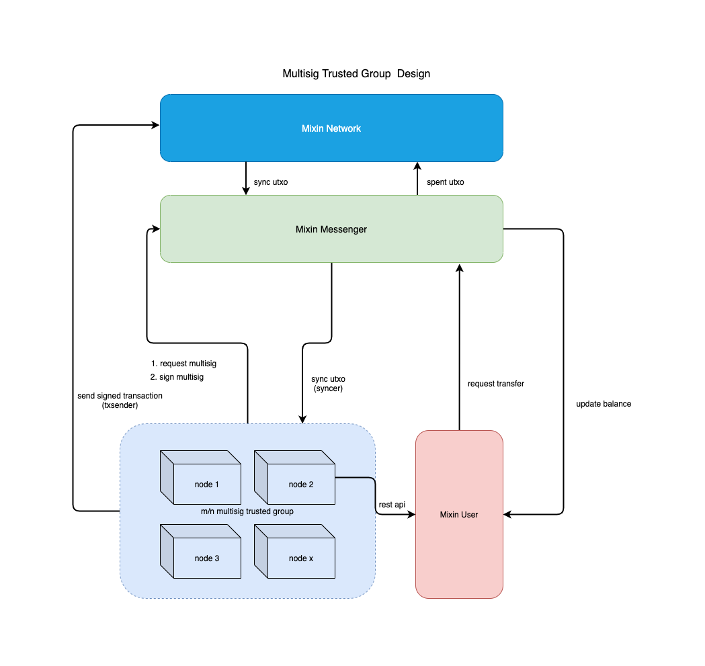
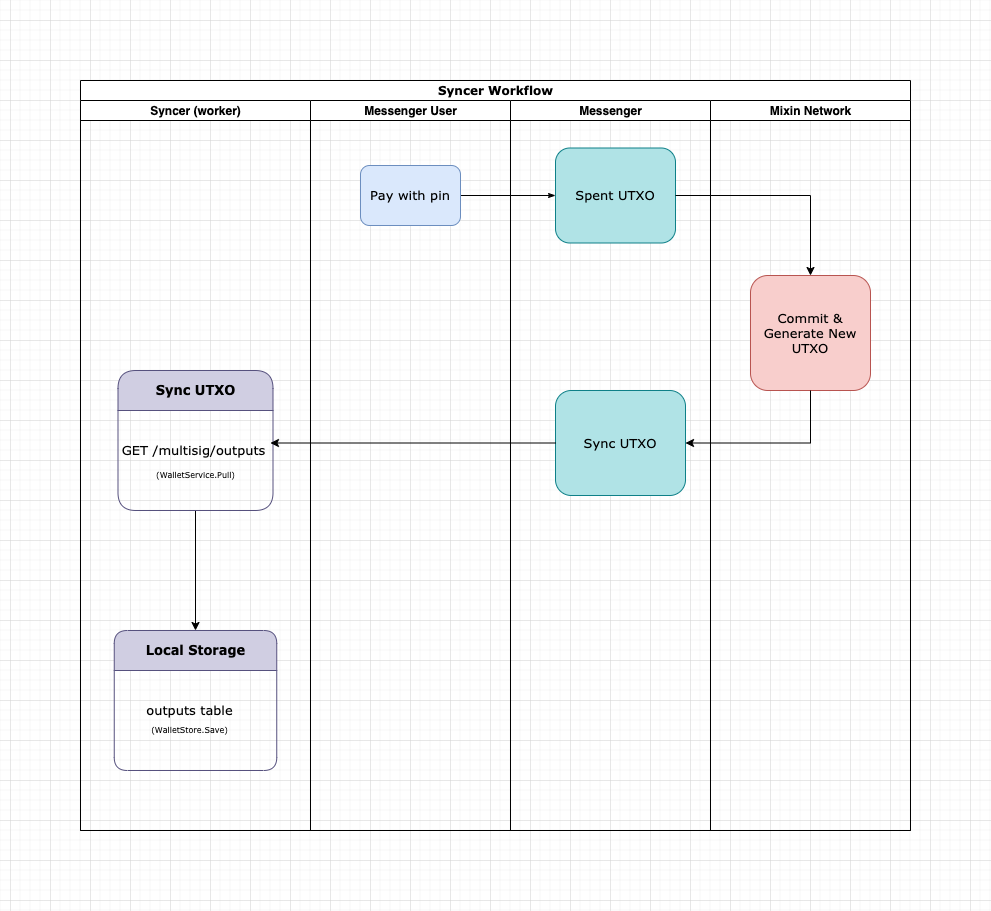

## 4swap Design Document

> Pando Lake는 Uniswap V2의 Mixin 네트워크에 구현된 MTG 입니다.

Pando Lake는 일관된 생산량 공식으로 구동되고 [Mixin Trusted Group](https://developers.mixin.one/docs/mainnet/mtg/overview)에서 구현되는 자동화된 유동성 프로토콜입니다. 단일 Mixin Dapp의 필요성을 배제하고 분산화, 검열 저항 및 보안을 우선시합니다.

풀 토큰에 대한 대가로 각 기본 토큰의 동등한 가치를 예치함으로써 누구나 풀의 유동성 공급자(LP) 가 될 수 있습니다. 이 토큰은 전체 적립금의 비례 배분 LP 지분을 추적하고 언제든지 기본 자산으로 상환될 수 있습니다.

페어는 상수 곱 공식이 유지되는 한 자동화된 시장 메이커 역할을 하며 한 코인을 다른 코인으로 교환해 드릴 준비가 항상 되어 있습니다. 가장 간단하게 **x * y = k**으로 표현되는 이 공식은 교환이 한 페어의 예비 균형 (x와 y) 의 곱 (k) 을 변화시켜서는 안 된다는 것을 말합니다. K는 거래의 기준 프레임에서 변하지 않기 때문에 종종 불변수로 언급되기도 합니다. 이 공식은 (예치금 대비) 큰 거래가 작은 거래보다 기하급수적으로 느린 속도로 실행되는 바람직한 속성을 가지고 있습니다.

> USDT/USDC와 같은 스테이블 코인 풀에서 사용되는 수정된 [Curve](https://curve.fi) 공식.

## Interact with 4swap

All participants of 4swap complete the interaction by transferring tokens to the multisig wallet. Node worker **Syncer** syncs the payments as mixin multisig outputs; another worker **Payee** processes all outputs in order.

### Mixin Multisig Output

**Output:**

| field     | description      |
| --------- | ---------------- |
| CreatedAt | payment time     |
| AssetID   | payment asset id |
| Amount    | payment amount   |
| Memo      | extra message    |

**Output Memo:**

**Memo** contain the **TransactionAction** information.

The memo is AES-encrypted, an ed25519 public key used for compound AES key/iv will be in the first 32 bytes.

### TransactionAction Definition

| field      | description                                | type   |
| ---------- | ------------------------------------------ | ------ |
| Action     | swap, deposit or withdraw                  | number |
| UserID     | mixin id used for receipt                  | uuid   |
| FollowID   | user defined trace id for this transaction | uuid   |
| Parameters | relevant parameters                        | bytes  |

## Workers

1. **Syncer** sync unhanded utxo by mixin messenger api & store into WalletStore as **outputs** in created asc order.
2. **Payee** pull unhanded utxo from WalletStore in order and parse memo to get the action then handle it. Transfers may be created during handling.
3. **Assigner** select enough unspent UTXO and assign to a pending transfer.
4. **Cashier** pull unhandled transfers from WalletStore in order, then request & sign multisig transfer. If enough signatures collected, generate a raw transaction.
5. **TxSender** commit raw transactions to Mixin Network.

### Syncer Workflow

### Payee Workflow

### Assigner & Cashier & TxSender Workflow

## Actions

### Deposit

Each Pando Lake liquidity pool is a trading venue for a pair of Mixin Mainnet tokens. When a pool is created by the governance, its balances of each token are 0; in order for the pool to begin facilitating trades, someone must seed it with an initial deposit of each token. This first liquidity provider is the one who sets the initial price of the pool.

The number of liquidity tokens This first liquidity provider will receive would equal `sqrt(x*y)`, where x and y represent the amount of each token provided. For the following providers, the number will be `min(x/reserve_x,y/reserve_y)*liquidity_shares`.

**Parameters:**

| name     | type    | description                |
| -------- | ------- | -------------------------- |
| AssetID  | uuid    | opposite asset id          |
| Slippage | decimal | max slippage allowed       |
| Expire   | int64   | deposit timeout in seconds |

### Swap

From the constant product formula it follows that the price of that token A is simply price_token_A = reserve_token_B / reserve_token_A. The market price only moves as the reserve ratio of the tokens in the pool changes, which happens when someone trades against it.

The swapping rule is the constant product formula. When either token is withdrawn, a proportional amount of the other must be deposited, in order to make the constant(`k`) unchange.

Pando Lake applies a 0.3% fee (0.04% for stablecoin pools) to trades, which is added to reserves to increases `k` actually as a payout to liquidation providers.

**Parameters:**

| name    | type    | description                                 |
| ------- | ------- | ------------------------------------------- |
| AssetID | uuid    | target asset id                             |
| Route   | string  | swap routes                                 |
| minimum | decimal | minimum amount acceptable, refund otherwise |

### Withdraw

To retrieve the underlying liquidity, plus any fees accrued, liquidity providers must give back their liquidity tokens, effectively exchanging them for their portion of the liquidity pool, plus the proportional fee allocation.

The number of tokens retrieved will be `lp_token/liquidity_shares*reserve_x` and `lp_token/liquidity_shares*reserve_y`.
