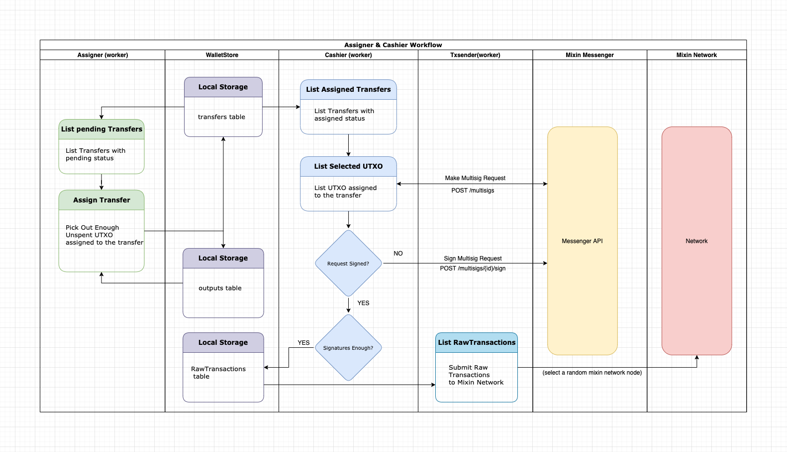

## 4swap Design Document

> Pando Lake 是在Uniswap V2 在 Mixin网络上的实现

Pando Lake是由恒定产量公式驱动的自动化流动性协议，部署在[Mixin Trusted Group](https://developers.mixin.one/docs/mainnet/mtg/overview)。 它消除了对单一 Mixin Dapp 的需求，优先考虑去中心化、审查阻力和安全性。

任何人都可以通过存入每个等值价值的基础代币来换取矿池代币，从而成为矿池的流动性提供者 (LP)。 这些代币按比例跟踪总储备中的 LP 份额，并且可以随时赎回相关资产。

交易对充当自动化做市商，并在保留“恒定乘积”公式的前提下，随时准备接受一种代币兑换另一种代币。 这个公式，最简单的表示为 **x * y = k**，规定交易不得改变一对准备金余额（x 和 y）的他们的乘积 (k)。 因为 k 相对于交易的参考系保持不变，所以它通常被称为不变量。 这个公式有一个理想的特性，即较大额的交易（相对于储备）的执行速度比较小额的交易要差得多。

> 用于稳定币池（如 USDT/USDC）的修改后的[Curve](https://curve.fi)公式。

## Interact with 4swap

All participants of 4swap complete the interaction by transferring tokens to the multisig wallet. Node worker **Syncer** syncs the payments as mixin multisig outputs; another worker **Payee** processes all outputs in order.

### Mixin Multisig Output

**Output:**

| field     | description      |
| --------- | ---------------- |
| CreatedAt | payment time     |
| AssetID   | payment asset id |
| Amount    | payment amount   |
| Memo      | extra message    |

**Output Memo:**

**Memo** contain the **TransactionAction** information.

The memo is AES-encrypted, an ed25519 public key used for compound AES key/iv will be in the first 32 bytes.

### TransactionAction Definition

| field      | description                                | type   |
| ---------- | ------------------------------------------ | ------ |
| Action     | swap, deposit or withdraw                  | number |
| UserID     | mixin id used for receipt                  | uuid   |
| FollowID   | user defined trace id for this transaction | uuid   |
| Parameters | relevant parameters                        | bytes  |

## Workers

1. **Syncer** sync unhanded utxo by mixin messenger api & store into WalletStore as **outputs** in created asc order.
2. **Payee** pull unhanded utxo from WalletStore in order and parse memo to get the action then handle it. Transfers may be created during handling.
3. **Assigner** select enough unspent UTXO and assign to a pending transfer.
4. **Cashier** pull unhandled transfers from WalletStore in order, then request & sign multisig transfer. If enough signatures collected, generate a raw transaction.
5. **TxSender** commit raw transactions to Mixin Network.

### Syncer Workflow

### Payee Workflow

### Assigner & Cashier & TxSender Workflow

## Actions

### Deposit

Each Pando Lake liquidity pool is a trading venue for a pair of Mixin Mainnet tokens. When a pool is created by the governance, its balances of each token are 0; in order for the pool to begin facilitating trades, someone must seed it with an initial deposit of each token. This first liquidity provider is the one who sets the initial price of the pool.

The number of liquidity tokens This first liquidity provider will receive would equal `sqrt(x*y)`, where x and y represent the amount of each token provided. For the following providers, the number will be `min(x/reserve_x,y/reserve_y)*liquidity_shares`.

**Parameters:**

| name     | type    | description                |
| -------- | ------- | -------------------------- |
| AssetID  | uuid    | opposite asset id          |
| Slippage | decimal | max slippage allowed       |
| Expire   | int64   | deposit timeout in seconds |

### Swap

From the constant product formula it follows that the price of that token A is simply price_token_A = reserve_token_B / reserve_token_A. The market price only moves as the reserve ratio of the tokens in the pool changes, which happens when someone trades against it.

The swapping rule is the constant product formula. When either token is withdrawn, a proportional amount of the other must be deposited, in order to make the constant(`k`) unchange.

Pando Lake applies a 0.3% fee (0.04% for stablecoin pools) to trades, which is added to reserves to increases `k` actually as a payout to liquidation providers.

**Parameters:**

| name    | type    | description                                 |
| ------- | ------- | ------------------------------------------- |
| AssetID | uuid    | target asset id                             |
| Route   | string  | swap routes                                 |
| minimum | decimal | minimum amount acceptable, refund otherwise |

### Withdraw

To retrieve the underlying liquidity, plus any fees accrued, liquidity providers must give back their liquidity tokens, effectively exchanging them for their portion of the liquidity pool, plus the proportional fee allocation.

The number of tokens retrieved will be `lp_token/liquidity_shares*reserve_x` and `lp_token/liquidity_shares*reserve_y`.
