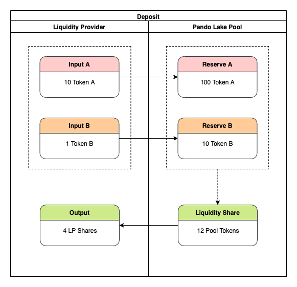
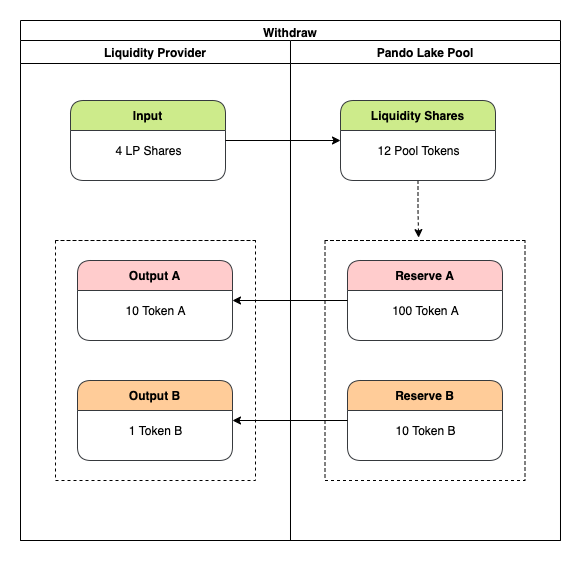
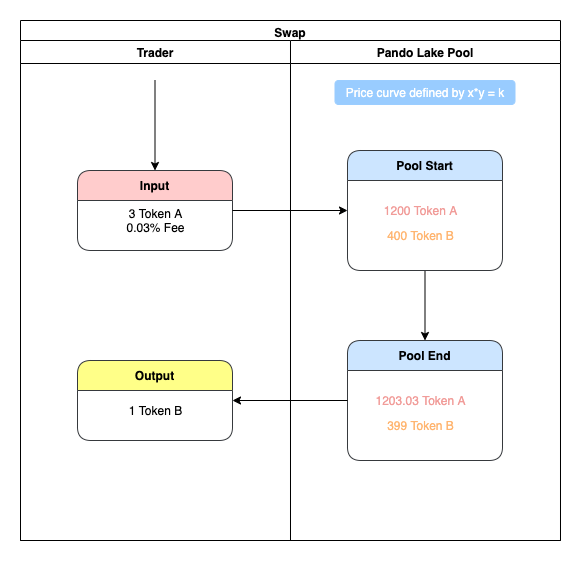

## Pando Lake 设计

> Pando Lake 是在Uniswap V2 在 Mixin网络上的实现

Pando Lake是一个自动化流动性协议，由一个固定的公式驱动，通过 [Mixin Mulsig Groups](https://developers.mixin.one/document/mainnet/mtg/overview) 实现。 它消除了对单一 Mixin Dapp 的需求，优先考虑去中心化、审查阻力和安全性。

任何人都可以通过存入每个等值价值的基础代币来换取矿池代币，从而成为矿池的流动性提供者 (LP)。 这些代币按比例跟踪总储备中的 LP 份额，并且可以随时赎回相关资产。

交易对充当自动化做市商，并在保留“恒定乘积”公式的前提下，随时准备接受一种代币兑换另一种代币。 这个公式，最简单的表示为 **x * y = k**，规定交易不得改变一对准备金余额（x 和 y）的乘积 (k)。 因为 k 相对于交易的参考系保持不变，所以它通常被称为不变量。 这个公式有一个理想的特性，即较大额的交易（相对于储备）的执行速度比较小额的交易要差得多。

> 用于稳定币池（如 USDT/USDC）的修改后的[Curve](https://curve.fi)公式。

## 存入

每个 Pando Lake 流动性池都是一对 Mixin Mainnet 代币的交易场所。 治理者创建矿池时，其每个代币的余额为0； 为了让矿池开始促进交易，必须有人存入每个代币的初始存款作为种子。 第一个流动性提供者是设定流动池初始价格的人。

第一个流动性提供者将收到的流动性代币数量将等于 `sqrt(x*y)`，其中 x 和 y 代表提供的每个代币的数量。 对于之后的提供者，数字将为 `min(x/reserve_x,y/reserve_y)*liquidity_shares`。

## 取回

为了恢复基础流动性，加上所有应计费用，流动性提供者必须返还他们的流动性代币，才能有效地将它们交换为他们在流动性池中的部分，包括按比例分配的手续费费用。

返回的代币数量将会是 `lp_token/liquidity_shares*reserve_x` 和 `lp_token/liquidity_shares*reserve_y`。

## 互换交易

从常数乘积公式可以得出，代币 A 的价格就是 price_token_A = reserve_token_B / reserve_token_A。 市场价格只会随着池中代币比率的变化而变化，当有人与它进行交易时就会发生这种情况。

交换规则是常数乘积公式。 当任一代币被提取时，必须按比例存入另一个代币，以使常数 (`k`) 保持不变。

Pando Lake 对交易收取 0.3% 的费用（稳定币池为 0.04%），将其添加到准备金中以增加 `k` ，实际上作为对流动性提供者的支付。

